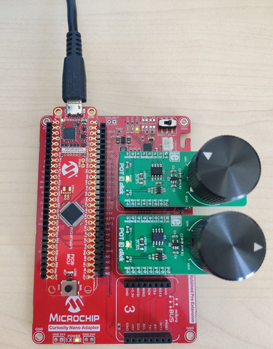
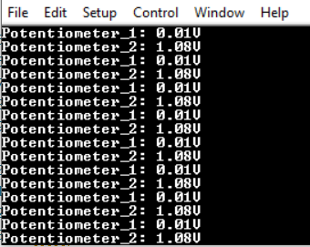

# Analog-to-Digital Converter with Computation (ADCC) and Context Switching — Context Switching Using PIC18F56Q71 Microcontroller with MCC Melody

This code example demonstrates how to perform two Analog-to-Digital Converter with Computation (ADCC) and Context Switching conversions from two input channels that have different peripheral configurations by using the Context Switching feature. The ADCC with Context Switching supports up to four configuration contexts and offers the option of switching between these contexts at run-time. By using this feature, a single ADCC with Context Switching peripheral is used to capture data from multiple analog input channels, each one of them having its own configuration. The conversion results are processed and displayed on a terminal software by using serial communication via an UART peripheral.

## Related Documentation

More details and code examples on the PIC18F56Q71 can be found at the following links:

- [PIC18F56Q71 Product Page](https://www.microchip.com/en-us/product/PIC18F56Q71)
- [PIC18F56Q71 Code Examples on GitHub](https://github.com/orgs/microchip-pic-avr-examples/repositories?q=pic18f56q71&type=all&language=&sort=)

## Software Used

- [MPLAB® X IDE](http://www.microchip.com/mplab/mplab-x-ide) v6.05 or newer
- [MPLAB® X IPE](https://www.microchip.com/en-us/tools-resources/production/mplab-integrated-programming-environment) v6.05 or newer
- [MPLAB® XC8](http://www.microchip.com/mplab/compilers) v2.40 or newer
- [PIC18F-Q Series Device Pack](https://packs.download.microchip.com/) v1.15.360 or newer

## Hardware Used

- The PIC18F56Q71 Curiosity Nano Development board is used as a test platform:
   

- Curiosity Nano Adapter:
   

- POT 3 CLICK Board:
   

 

## Operation

To program the Curiosity Nano board with this MPLAB® X project, follow the steps provided in the [How to Program the Curiosity Nano Board](#how-to-program-the-curiosity-nano-board) chapter.  

## Setup

The following configurations must be made for this project:

- The system clock is configured at 64 MHz - ADCRC Oscillator enabled
- ADCC with Context Switching:
  - Input Configuration: Single-Ended mode
  - Result Format: Right justified
  - VDD: 3.3 V
  - Clock Selection: ADCRC
  - Enable Context 1:
    - Positive Channel Selection: ANA1
    - Positive Voltage Reference: VDD
    - Operating Mode Selection: Average mode
    - Error Calculation Mode: First derivative of single measurement
  - Enable Context 2:
    - Positive Channel Selection: ANA2
    - Positive Voltage Reference: VDD
    - Operating Mode Selection: Basic mode
    - Error Calculation Mode: First derivative of single measurement
- UART2:
  - 115200 baud rate
  - 8 data bits
  - No parity bit
  - 1 Stop bit
- UART2PLIB:
  - Redirect STDIO to UART: enabled
  - Enable Receive: enabled
  - Enable Transmit: enabled

| Pin | Configuration  |
| :-: | :------------: |
| RA1 |  Analog input  |
| RA2 |  Analog input  |
| RB4 | Digital output |
| RB5 | Digital input  |

[Back to Top](#analog-to-digital-converter-with-computation-adcc-and-context-switching--context-switching-using-pic18f56q71-microcontroller-with-mcc-melody) 

 

## Demo

In this example, the ADC reads data from the two potentiometers using context switching and displays the result on the serial terminal.

 

 

[Back to Top](#analog-to-digital-converter-with-computation-adcc-and-context-switching--context-switching-using-pic18f56q71-microcontroller-with-mcc-melody) 

## Summary

This example shows how to configure the ADCC with Context Switching using the MPLAB® Code Configurator. Also, it demonstrates the use of context switching for acquiring data from multiple analog inputs.
 

[Back to Top](#analog-to-digital-converter-with-computation-adcc-and-context-switching--context-switching-using-pic18f56q71-microcontroller-with-mcc-melody) 
 

## How to Program the Curiosity Nano Board

This chapter demonstrates how to use the MPLAB® X IDE to program an PIC® device with an Example_Project.X. This can be applied to any other project.

1.  Connect the board to the PC.

2.  Open the Example_Project.X project in MPLAB® X IDE.

3.  Set the Example_Project.X project as main project.
     Right click the project in the **Projects** tab and click **Set as Main Project**.
     

4.  Clean and build the Example_Project.X project.
     Right click the **Example_Project.X** project and select **Clean and Build**.
     

5.  Select **PICxxxxx Curiosity Nano** in the Connected Hardware Tool section of the project settings:
     Right click the project and click **Properties**.
     Click the arrow under the Connected Hardware Tool.
     Select **PICxxxxx Curiosity Nano** (click the **SN**), click **Apply** and then click **OK**.
     

6.  Program the project to the board.
     Right click the project and click **Make and Program Device**.
     

 

- [Back to Setup](#setup)
- [Back to Demo](#demo)
- [Back to Summary](#summary)
- [Back to Top](#analog-to-digital-converter-with-computation-adcc-and-context-switching--context-switching-using-pic18f56q71-microcontroller-with-mcc-melody) 
